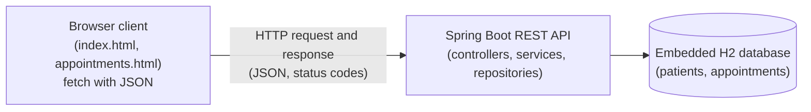
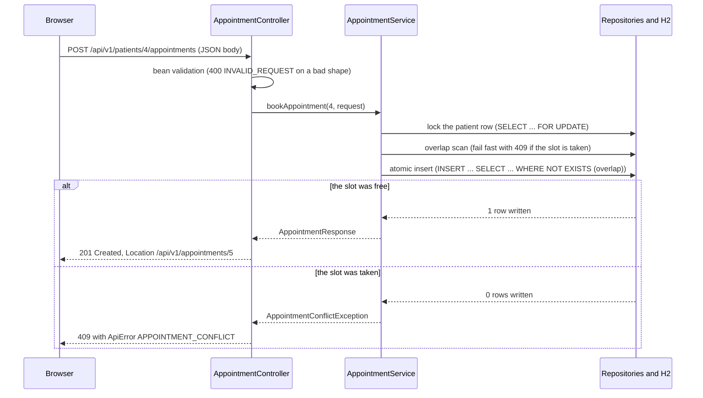

# Clinic Appointment System, architecture notes

This document describes the parts of the system, how a request moves through them and how the design maps to the COMP713 topics. It supports the written report.

## Overview

The system has three parts (browser client, Spring Boot API and embedded H2 database):

All state lives in the database. The API keeps no state between requests, and the browser keeps only what is currently on screen.

## The layers and their responsibilities

1. **Client** (`src/main/resources/static`). Two HTML pages with plain JavaScript and no frameworks (`js/app.js` holds the fetch helpers and DOM building, `js/registry.js` and `js/booking.js` hold the page logic). The pages call only the JSON API and build the UI in the browser from the responses. All dynamic text is inserted as text nodes (`createTextNode`), so user input can never run as HTML (the week 2 XSS rule).
2. **Controller layer** (`controller`). Translates HTTP. `PatientController` and `AppointmentController` validate the request shape (bean validation) and set status codes and the `Location` header. `GlobalExceptionHandler` maps every failure to the `ApiError` model. The DTO records (`PatientRequest`, `AppointmentRequest`, responses) are the API surface. JPA entities are never returned directly.
3. **Service layer** (`service`). The business use cases (`register`, `list`, `details`, `bookAppointment`, `getAppointment`, `rescheduleAppointment`, `cancelAppointment`). Each use case runs in one transaction (`@Transactional`) on a stateless singleton with constructor injection. Scheduling rules and conflict handling live here.
4. **Repository layer** (`repository`). Spring Data JPA for normal reads and deletes, plus parameterised JDBC statements (`AppointmentSlotWritesImpl`) for the atomic check and write of a booking.
5. **Database** (embedded H2). Two tables with a one-to-many relationship (one patient has many appointments).

## Communication flow (example: booking an appointment)

The request and response always use JSON (`Content-Type: application/json`). Creates answer 201 with a `Location` header that points at the new resource, reads and updates answer 200, and deletes answer 204 with an empty body.

## The error model

Every failure answers with the same `ApiError` shape (`code`, `message`, `path`). The code is stable and machine-readable so that clients can react without parsing the message.

| Status | Code | Meaning |
|---|---|---|
| 400 | `INVALID_REQUEST` | The body failed validation or is not valid JSON. The message lists the field errors. |
| 400 | `APPOINTMENT_TIME_INVALID` | The time breaks a scheduling rule (in the past, at a weekend, or outside opening hours). |
| 404 | `PATIENT_NOT_FOUND` | Unknown patient id. |
| 404 | `APPOINTMENT_NOT_FOUND` | Unknown appointment id. |
| 409 | `PATIENT_EXISTS` | The e-mail address is already registered. |
| 409 | `APPOINTMENT_CONFLICT` | The slot overlaps an existing appointment of the same patient. |
| 415 | `UNSUPPORTED_MEDIA_TYPE` | The request Content-Type is not application/json. |
| 500 | `INTERNAL_ERROR` | Any unexpected failure (generic message, no stack traces). |

## Data design

Two related tables (one patient to many appointments):

- `patients` (`id`, `first_name`, `last_name`, `email`, `phone`, `created_at`) with the unique constraint `uk_patient_email`.
- `appointments` (`id`, `patient_id`, `start_at`, `end_at`, `reason`, `created_at`) with the foreign key to `patients`, the unique constraint `uk_appointment_patient_start` on (`patient_id`, `start_at`) and the check constraint `end_at > start_at`.

The overlap rule is `existing.start_at < new_end AND existing.end_at > new_start`, so back-to-back bookings do not conflict. Deleting a patient also deletes their appointments (a cascading delete in the JPA mapping). The full documented schema is in `database/schema-reference.sql`.

## Concurrency (why booking is safe)

The rule is simple (a patient must not hold two overlapping appointments), but enforcing it under concurrent requests needs care. The design uses four layers, in this order:

1. **Serialise per patient.** Each booking change first locks the patient row (`SELECT ... FOR UPDATE`) and holds the lock to the end of the transaction, so concurrent changes for one patient run one at a time. An atomic statement alone would not be enough, because H2 has no range exclusion constraint and two overlapping ranges could otherwise both pass a check. Different patients never block each other (the rule is per patient).
2. **Fail fast.** Existence checks, time rules and a quick overlap scan run before any write, so the caller gets a clear error and nothing is touched.
3. **Atomic check and write.** The insert (or update) tests the overlap and writes in one statement (`INSERT ... SELECT ... WHERE NOT EXISTS (overlap)`), and the caller checks the affected rows. Zero rows means the slot was taken.
4. **Constraints as the backstop.** `uk_appointment_patient_start` rejects an identical start and `CHECK (end_at > start_at)` rejects a reversed range. The service translates these into the same 409 and 400 responses.

This follows the concurrency lesson of week 5 class 12 (a transaction is atomic but not automatically concurrency-safe) and uses the controls named there (atomic statements, uniqu constraints and pessimistic row locking). `ConcurrentBookingTest` proves the behaviour with real threads (see `evidence/concurrency-test.txt`).

## Mapping to COMP713 concepts (for the report)

| Concept (course topic) | Where it appears here |
|---|---|
| HTTP requests and responses, methods and status codes (week 2) | The `fetch` calls in the client and the seven handlers with their status codes (200, 201, 204, 400, 404, 409). |
| State scopes (request, session, application, database) (week 2) | The API is stateless and all shared state lives in the database (the narrowest safe scope for data that must survive requests). |
| Layered server design and parameterised SQL (week 3) | The controller, service and repository layers, and the parameterised JDBC slot statements. |
| Consistent state and no partial writes (week 4) | A booking is written by one atomic statement inside one transaction, so the database is always consistent (a booking exists fully or not at all). |
| RPC and tight coupling versus loose coupling (week 5, class 11) | Client and server are loosely coupled through a JSON over HTTP contract, unlike RMI stubs that share object types and interfaces. |
| Services, dependency injection and transactions (week 5, class 12) | Constructor injection, stateless singleton services and `@Transactional` around each complete use case. |
| Concurrency controls (week 5, class 12) | Atomic conditional statements, named constraints and pessimistic row locking (see above). |
| REST resources and contracts (week 6) | Resource URIs (`/api/v1/patients`, `/api/v1/appointments`), 201 with `Location`, and the stable machine-readable error codes in `ApiError`. |
